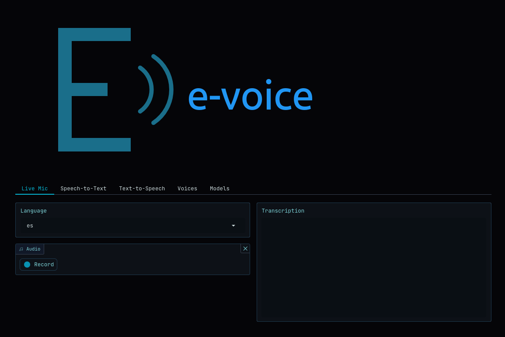

<p align="center">
  
</p>

<p align="center">
  <strong>Production-grade Speech API</strong> — STT (faster-whisper) + TTS (Kokoro-ONNX)<br>
  HTTP, SSE, chunked streaming, and WebSocket transports
</p>

<p align="center">
  Powered by <a href="https://github.com/sparckles/Robyn">Robyn</a> (Rust-backed async Python)
</p>

---

## Quick Start

```bash
docker run -p 5500:80 --gpus all ghcr.io/damvolkov/e-voice:latest
```

Open `http://localhost:5500` — Gradio UI, API, and docs on one port.

```bash
# Local development
make install
make dev              # API on :5500, WS on :5700, Gradio UI on :5600
```

| Service | Local | Docker |
|---------|-------|--------|
| Gradio UI | `localhost:5600` | `localhost:5500` |
| REST API | `localhost:5500/v1/...` | `localhost:5500/v1/...` |
| WebSocket | `ws://localhost:5700/v1/...` | `ws://localhost:5500/v1/...` |
| Docs | `localhost:5500/docs` | `localhost:5500/docs` |

In Docker, nginx routes HTTP and WebSocket on the same port (`/v1/` paths auto-detect via `Upgrade` header).

---

## Transport Map

Every endpoint is available via four transport protocols. Taxonomical aliases make the transport explicit in the URL.

| Service | Transport | Endpoint | Alias | Content-Type |
|---------|-----------|----------|-------|-------------|
| **STT** | HTTP | `POST /v1/audio/transcriptions` | `/v1/stt/http` | `application/json`, `text/plain` |
| **STT** | SSE | `POST /v1/audio/transcriptions` + `stream=true` | `/v1/stt/sse` | `text/event-stream` |
| **STT** | WebSocket | `WS /v1/audio/transcriptions` | `WS /v1/stt/ws` | binary PCM16-LE or text (base64) |
| **TTS** | HTTP | `POST /v1/audio/speech` + `stream=false` | `/v1/tts/http` | `audio/*` |
| **TTS** | SSE | `POST /v1/audio/speech` + `stream_format=sse` | `/v1/tts/sse` | `text/event-stream` |
| **TTS** | Streaming | `POST /v1/audio/speech` + `stream=true` | `/v1/tts/stream` | `audio/*` (chunked) |
| **TTS** | WebSocket | `WS /v1/audio/speech` | `WS /v1/tts/ws` | text frames (JSON) |

Aliases point to the exact same handler — zero overhead, full compatibility.

---

## API Reference

Base URL: `http://localhost:5500`

### Speech-to-Text (STT)

#### HTTP — `POST /v1/stt/http`

Send an audio file, receive the full transcription.

**Request**: `multipart/form-data`

| Field | Type | Default | Description |
|-------|------|---------|-------------|
| `file` | binary | required | Audio file (WAV, MP3, FLAC, etc.) |
| `model` | string | config default | Whisper model ID |
| `language` | string | auto-detect | ISO 639-1 code |
| `prompt` | string | — | Context hint |
| `response_format` | string | `json` | `json`, `text`, `verbose_json`, `srt`, `vtt` |
| `temperature` | float | `0.0` | Sampling temperature (0.0–1.0) |
| `vad_filter` | bool | `false` | Voice Activity Detection |
| `hotwords` | string | — | Bias toward specific words |
| `timestamp_granularities[]` | string | `segment` | `segment` or `word` |

**Response formats**:

```json
// json
{"text": "Hello world."}

// verbose_json
{"task": "transcribe", "language": "en", "duration": 2.5, "text": "Hello world.", "segments": [...], "words": [...]}
```

```
// text
Hello world.

// srt
1
00:00:00,000 --> 00:00:02,500
Hello world.

// vtt
WEBVTT

00:00:00.000 --> 00:00:02.500
Hello world.
```

Translation: `POST /v1/stt/translate` (same fields, outputs English).

#### SSE — `POST /v1/stt/sse`

Same request with `stream=true`. Returns `text/event-stream`:

```
data: Hello
data:  world.
data: [DONE]
```

#### WebSocket — `WS /v1/stt/ws`

Real-time streaming STT with LocalAgreement.

**Query parameters**: `?language=es&response_format=json&model=...`

**Protocol**:
1. Connect with optional query params
2. Send audio chunks (16kHz mono):
   - **Binary frames** (recommended): raw PCM16-LE bytes — zero overhead, industry standard
   - **Text frames** (backward compat): base64-encoded PCM16
3. Send `END_OF_AUDIO` as text frame to flush the session
4. Receive streaming transcription events

**Response** (`response_format=json`):

```json
{"type": "transcript_update", "text": "Hola mundo", "partial": "qué tal", "is_final": false}
{"type": "transcript_final", "text": "Hola mundo, qué tal.", "partial": "", "is_final": false}
{"type": "session_end", "text": "Hola mundo, qué tal.", "partial": "", "is_final": true}
```

When `response_format=text`: returns confirmed text as plain string.

**Features**:
- **Binary PCM16-LE frames** — same format as OpenAI Realtime, Deepgram, Azure Speech, AssemblyAI
- LocalAgreement — words are never retracted once confirmed
- Sentence-boundary finalization + same-output detection
- Bounded audio buffer (45s max) with context re-transcription
- Per-connection state with automatic cleanup
- Base64 text frames still supported for backward compatibility

### Text-to-Speech (TTS)

#### HTTP — `POST /v1/tts/http`

Send text, receive complete audio file.

**Request**: `application/json`

```json
{
  "input": "Hello world.",
  "model": "kokoro",
  "voice": "af_heart",
  "response_format": "wav",
  "speed": 1.0,
  "stream": false
}
```

| Field | Type | Default | Description |
|-------|------|---------|-------------|
| `input` | string | required | Text to synthesize |
| `model` | string | `kokoro` | TTS model |
| `voice` | string | `af_heart` | Voice ID (prefix = language) |
| `response_format` | string | `mp3` | `pcm`, `mp3`, `wav`, `flac`, `opus`, `aac` |
| `speed` | float | `1.0` | Speed multiplier (0.25–4.0) |
| `stream` | bool | `true` | Enable streaming |

Voices: `GET /v1/audio/voices`

#### SSE — `POST /v1/tts/sse`

Request with `stream=true` + `stream_format=sse`. Returns `text/event-stream`:

```json
{"type": "speech.audio.delta", "audio": "<base64_pcm16_24khz>"}
{"type": "speech.audio.delta", "audio": "<base64_pcm16_24khz>"}
{"type": "speech.audio.done"}
```

#### Streaming — `POST /v1/tts/stream`

Request with `stream=true` + `stream_format=audio`. Returns chunked binary audio with `Content-Type: audio/*`.

#### WebSocket — `WS /v1/tts/ws`

Real-time streaming TTS.

**Protocol**:
1. Connect
2. Send JSON: `{"input": "Hello", "voice": "af_heart", "speed": 1.0}`
3. Receive audio chunks:

```json
{"type": "speech.audio.delta", "audio": "<base64_pcm16_24khz>"}
{"type": "speech.audio.done"}
```

### Health & Models

| Method | Endpoint | Description |
|--------|----------|-------------|
| `GET` | `/health` | Health check + service info |
| `GET` | `/v1/models` | List loaded models |
| `GET` | `/v1/models/:model_id` | Get model info |
| `GET` | `/v1/models/list` | List downloaded models on disk |
| `POST` | `/v1/models/download` | Download model from HuggingFace |

---

## OpenAI Compatibility

e-voice is a drop-in replacement for the [OpenAI Audio API](https://platform.openai.com/docs/api-reference/audio):

| OpenAI Endpoint | e-voice | Status |
|-----------------|---------|--------|
| `POST /v1/audio/transcriptions` | Same | Full |
| `POST /v1/audio/translations` | Same | Full |
| `POST /v1/audio/speech` | Same | Full |
| `GET /v1/models` | Same | Full |

```python
from openai import OpenAI

client = OpenAI(base_url="http://localhost:5500/v1", api_key="unused")

result = client.audio.transcriptions.create(
    model="whisper-1", file=open("audio.wav", "rb")
)

response = client.audio.speech.create(
    model="kokoro", voice="af_heart", input="Hello world."
)
```

Extensions beyond OpenAI: SSE streaming, WebSocket transports, voice listing, model management.

---

## Development

```bash
make lint          # ruff check --fix + format
make type          # ty type check
make test          # unit tests (parallel, coverage >90%)
make check         # lint + type + test
make stt           # mic -> WebSocket STT binary PCM16 (ffmpeg + websocat)
make tts           # text -> TTS with playback (curl + ffplay)
make kill          # free ports 5500/5700/5600
```

## Web UI (Gradio)

<p align="center">
  
</p>

Launches automatically alongside the API:

- **Live Mic** — real-time WebSocket STT from browser microphone
- **Speech-to-Text** — upload audio, select model/language, transcribe (with SSE streaming)
- **Text-to-Speech** — enter text, pick voice/speed, synthesize audio (voices grouped by language)
- **Voices** — browse all available voices organized by language (9 languages, 50+ voices)
- **Models** — view and download STT/TTS models

| Environment | URL |
|-------------|-----|
| Local | `http://localhost:5600` |
| Docker | `http://localhost:5500` |

Disable via `front.enabled: false` in `data/config/config.yaml`.

## Configuration

All settings in `data/config/config.yaml` (YAML-based, typed via `pydantic-settings`):

```yaml
system:
  port: 5500
  debug: true

stt:
  model: "mobiuslabsgmbh/faster-whisper-large-v3-turbo"
  device: gpu           # gpu, cpu, or auto

tts:
  device: gpu
  default_voice: af_heart

front:
  enabled: true
  port: 5600
```

## Production Deployment

Pull the latest image from GHCR and run with GPU support. Create a `compose.prod.yml`:

```yaml
services:
  evoice:
    image: ghcr.io/damvolkov/e-voice:latest
    container_name: evoice
    hostname: evoice
    restart: unless-stopped
    deploy:
      resources:
        reservations:
          devices:
            - driver: nvidia
              count: 1
              capabilities: [gpu]
    labels:
      e-core.category: "audio"
      e-core.port: "5500"
    ports:
      # 5500 — e-voice STT + TTS Server (ai)
      - "${EVOICE_PORT:-5500}:80"
    volumes:
      - models:/app/data/models
      - ./config/evoice:/app/data/config:ro
    environment:
      - LOG_LEVEL=info
    healthcheck:
      test: ["CMD", "curl", "-f", "http://localhost:80/health"]
      interval: 30s
      timeout: 10s
      retries: 5
      start_period: 120s
    networks:
      - e-core

volumes:
  models:
    driver: local

networks:
  e-core:
    external: true
```

```bash
# Create config directory with your settings
mkdir -p config/evoice
cp data/config/config.yaml config/evoice/config.yaml
# Edit config/evoice/config.yaml as needed

docker compose -f compose.prod.yml up -d
```

Models are downloaded automatically on first startup and persisted in the `models` volume. If `config/evoice/` is empty or missing the `config.yaml`, the image uses its built-in defaults.

## Data Layout

```
data/
├── config/
│   └── config.yaml   # All app configuration
└── models/
    ├── stt/           # Downloaded Whisper models (gitignored)
    └── tts/           # Downloaded Kokoro models (gitignored)
```
