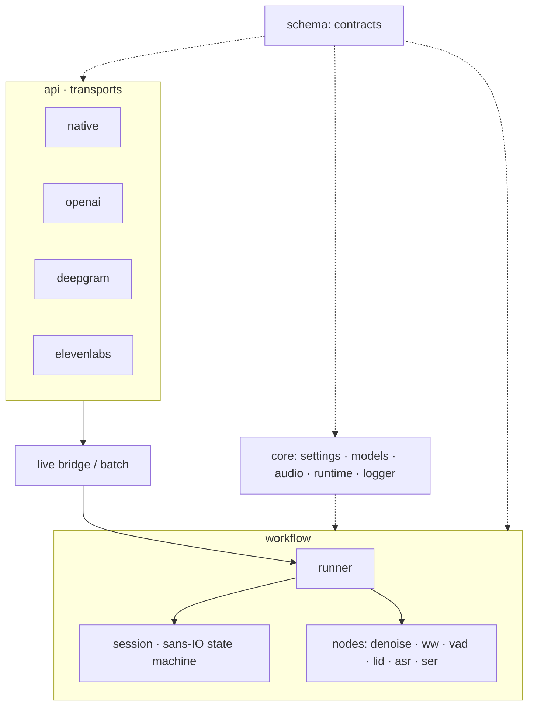

# Architecture

Hexagonal and event-driven. Every node is a port (a trait in `workflow/<node>/base.rs`) with one file per
backend and a registry that maps configuration to a built backend. Backends are built once at startup
and shared read-only by all streams.

## Layers

| Layer | Holds | May import |
|---|---|---|
| `schema` | contracts: audio, lang, emotion, segment, event, transcript, error | nothing |
| `config` | one typed section per node and domain | `schema`, `config` |
| `core` | settings, model store, audio decode/resample/AGC, native runtime, logger | `schema`, `config` |
| `workflow` | session, runner, nodes; nodes never import each other | `schema`, `config`, `core` |
| `api` | transports and protocol adapters | everything below |
| `ops` | internal tooling: benchmark suite, wake calibration, voice synthesis | everything below |

`make bounds` enforces the table with grep rules in the gate.

## Session

`Session` is a sans-IO state machine: `SessionInput` in (audio boundaries, partials, results, ticks,
drain, cancel), `SessionOutput` out (commands for the runner, events for the client). It owns the gate,
the join of ASR and SER per segment, deadlines and backpressure. Property tests check:

- exactly one final per segment, in segment order;
- never more than `pending` live segments;
- exactly one `closed`.

## Runner

The runner executes a session against the nodes:

- **Frame path, in order on the stream's task:** denoise → AGC → wake word → VAD → streaming ASR.
- **Segment work (batch ASR, LID, SER):** on the blocking pool, under a semaphore shared by all streams
  (`stt.pipeline.jobs`).
- **Intakes:**
  - `Live` follows the gate and the overload policy.
  - `File` skips the gate and stops reading while the backlog is full, so uploads are lossless.

## One onnxruntime

sherpa-onnx and `ort` share one `libonnxruntime` in the process (`ort` binds dynamically to the library
sherpa loaded). Thread spinning is disabled for both, so idle and paced streams cost no CPU.
