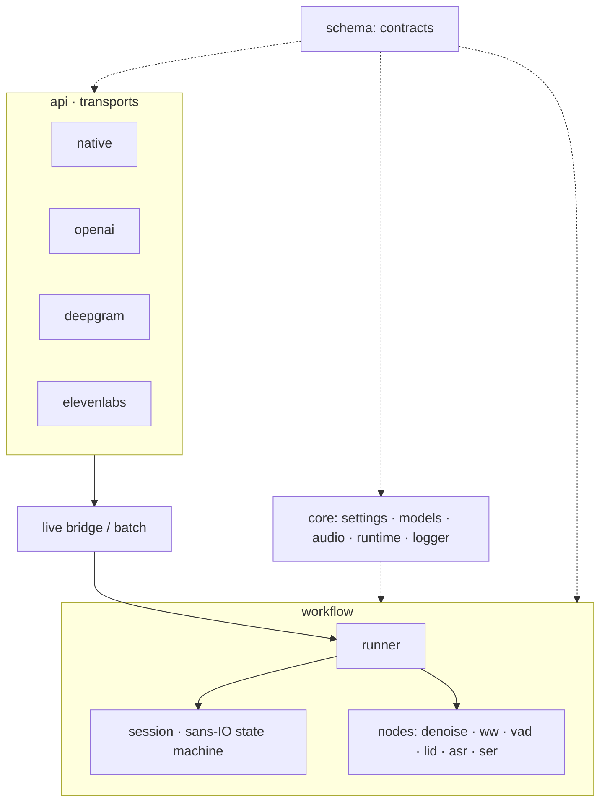
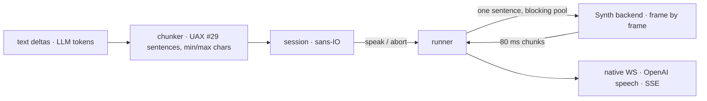

# Architecture

Three crates in one workspace, independent but combinable:

| Crate | Is | Depends on |
|---|---|---|
| `core` (`e-voice-core`) | settings loader, model store, onnxruntime binding, audio decode/resample/AGC, logger, process probe, shared contracts (`Lang`, errors) | nothing of ours |
| `stt` (`e-voice-stt`, binary `e-voice`, :5500) | speech-to-text pipeline and its gateway | `core` |
| `tts` (`e-voice-tts`, binary `e-voice-tts`, :5600) | streaming text-to-speech and its gateway | `core` |

Both services read the same `evoice.toml`: `[server]` is shared, each service types its own section and
keeps the other's opaque. Both bind the same `libonnxruntime` (vendored with sherpa-onnx into
`data/ops/sherpa`).

Hexagonal and event-driven. Every node is a port (a trait in `workflow/<node>/base.rs`) with one file per
backend and a registry that maps configuration to a built backend. Backends are built once at startup
and shared read-only by all streams.

## STT

### Layers

| Layer | Holds | May import |
|---|---|---|
| `schema` | contracts: audio, lang, emotion, segment, event, transcript, error | nothing |
| `config` | one typed section per node and domain | `schema`, `config` |
| `core` | settings, model store, audio decode/resample/AGC, native runtime, logger | `schema`, `config` |
| `workflow` | session, runner, nodes; nodes never import each other | `schema`, `config`, `core` |
| `api` | transports and protocol adapters | everything below |
| `ops` | internal tooling: benchmark suite, wake calibration, voice synthesis | everything below |

`make bounds` enforces the table with grep rules in the gate (the same layering holds in `tts`).

### Session

`Session` is a sans-IO state machine: `SessionInput` in (audio boundaries, partials, results, ticks,
drain, cancel), `SessionOutput` out (commands for the runner, events for the client). It owns the gate,
the join of ASR and SER per segment, deadlines and backpressure. Property tests check:

- exactly one final per segment, in segment order;
- never more than `pending` live segments;
- exactly one `closed`.

### Runner

The runner executes a session against the nodes:

- **Frame path, in order on the stream's task:** denoise → AGC → wake word → VAD → streaming ASR.
- **Segment work (batch ASR, LID, SER):** on the blocking pool, under a semaphore shared by all streams
  (`stt.pipeline.jobs`).
- **Intakes:**
  - `Live` follows the gate and the overload policy.
  - `File` skips the gate and stops reading while the backlog is full, so uploads are lossless.

## TTS

One port, `Synth` (`evoice/tts/src/workflow/synth/base.rs`), and the same shape: backends behind a registry,
a sans-IO session, a runner, transports.

- **Streaming only.** `SynthSession::speak` returns a lazy iterator: each `next` computes the next
  chunk, dropping it stops generation. A backend that renders a sentence whole and then slices it is
  rejected by the conformance test every backend must pass (`evoice/tts/tests/workflow/conformance.rs`):
  chunks ≤ 500 ms, a long sentence in more than one chunk, the first chunk before a quarter of the
  total time.
- **Barge-in.** `cancel` aborts the sentence within one chunk (the runner checks between chunks),
  drops what is queued, and keeps the stream open.
- **`train`.** Every backend has it; the default is `Unsupported`. It turns audio clips into an opaque
  voice the same backend opens later. Weight fine-tuning is not part of the port: it is model work
  (Python, GPU) that ends as a new pinned model in `evoice/tts/models.toml`.
- **Workers.** onnxruntime sessions run through `&mut`, so a backend keeps a pool of exclusive workers
  (`tts.synth.workers` per language, `threads` each); a stream leases one for its lifetime, and a full
  pool answers 503 before any audio.
- **Session guarantees** (property-tested): sentences spoken one at a time, in order; one `end` per
  `start`; no audio outside its sentence; one `closed`.

## One onnxruntime

sherpa-onnx and `ort` share one `libonnxruntime` in the process (`ort` binds dynamically to the library
sherpa loaded). Thread spinning is disabled for both, so idle and paced streams cost no CPU.
