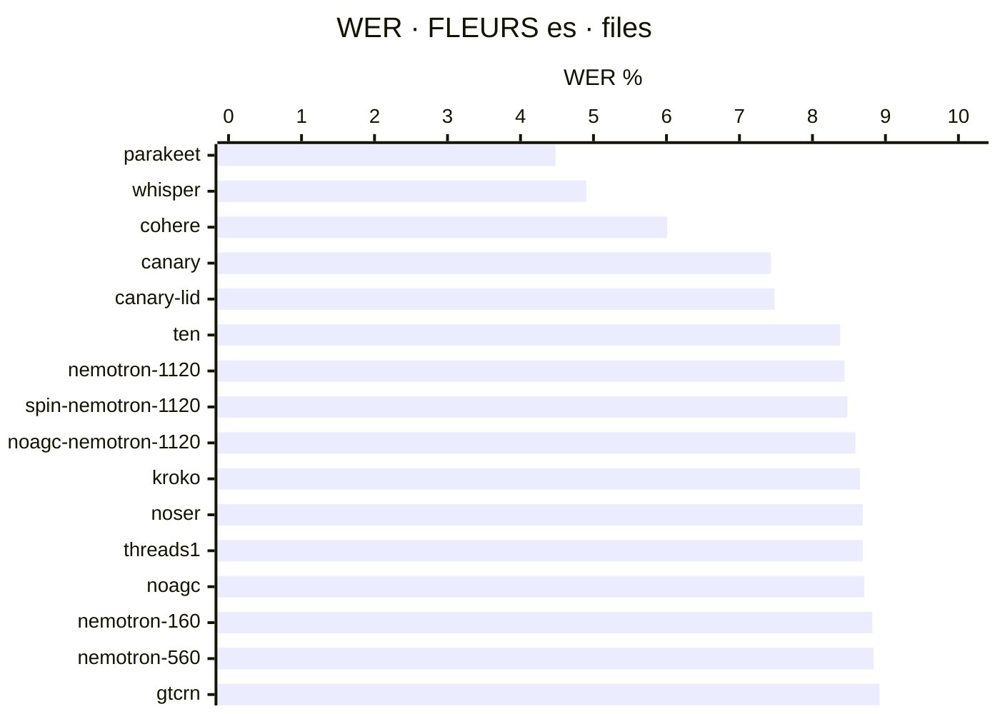
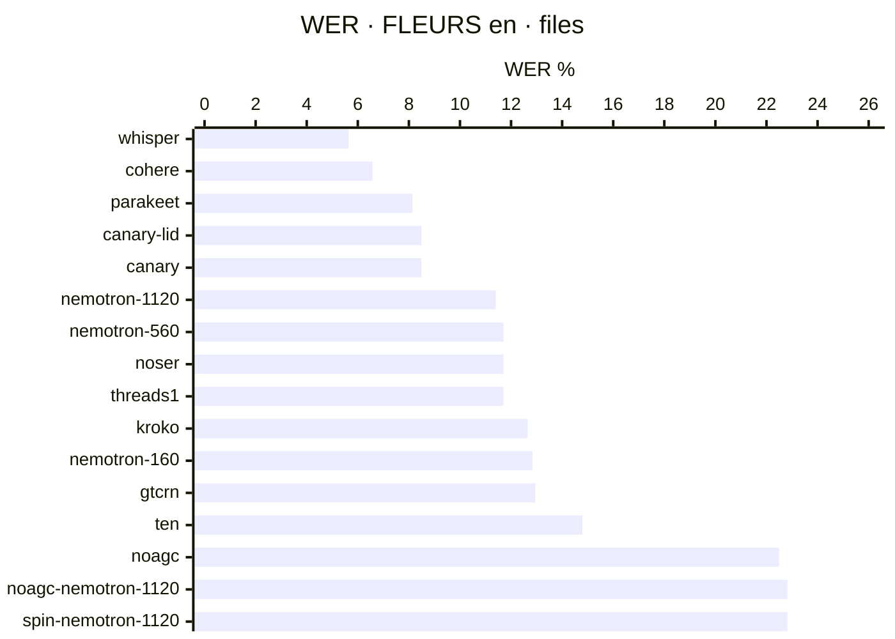
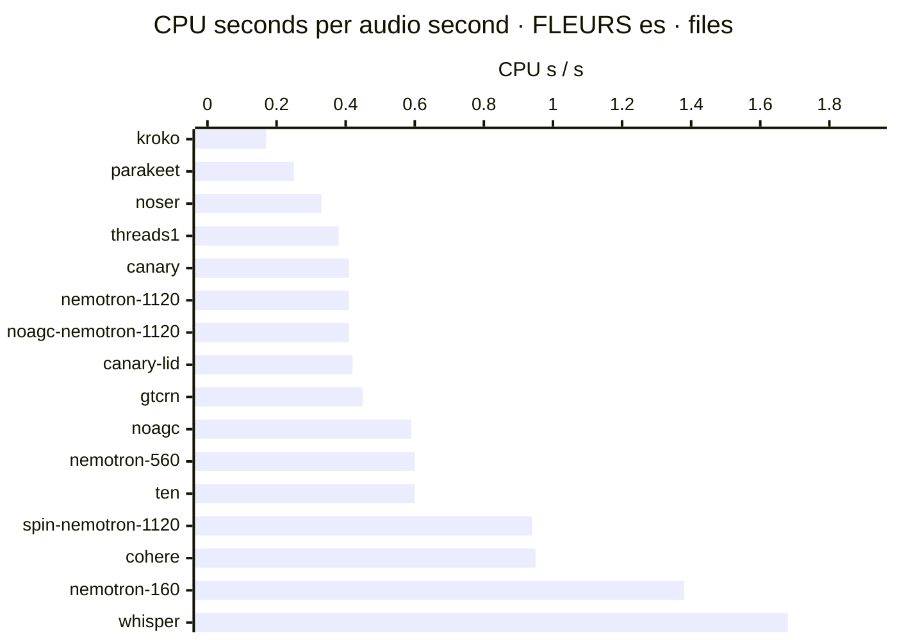
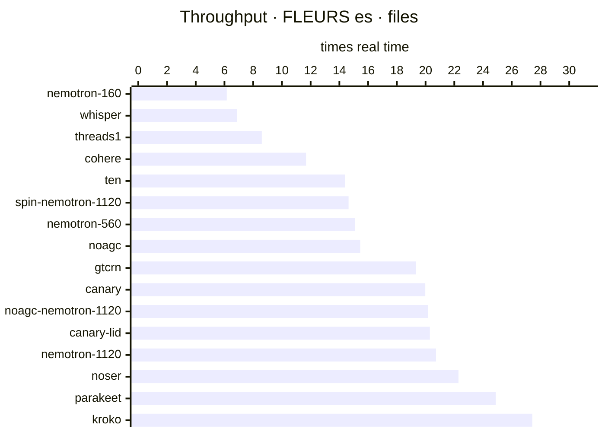
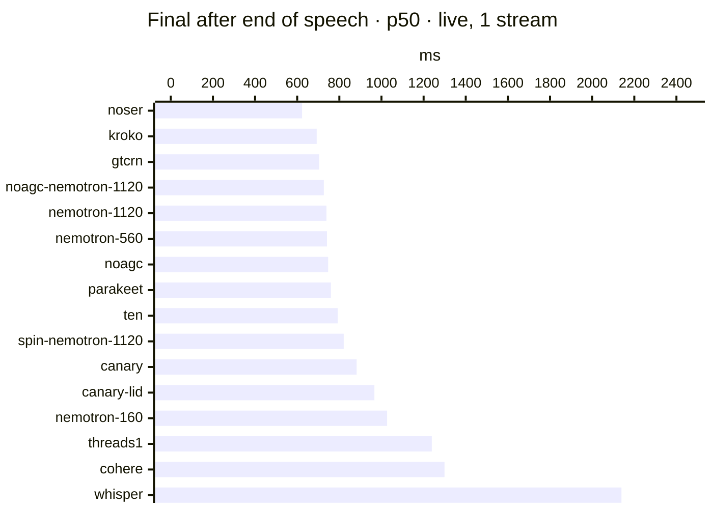
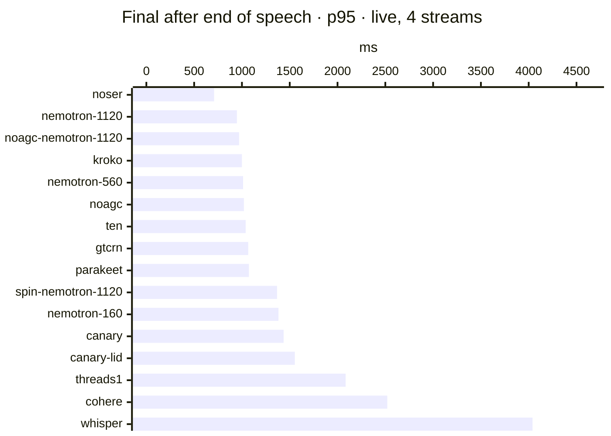
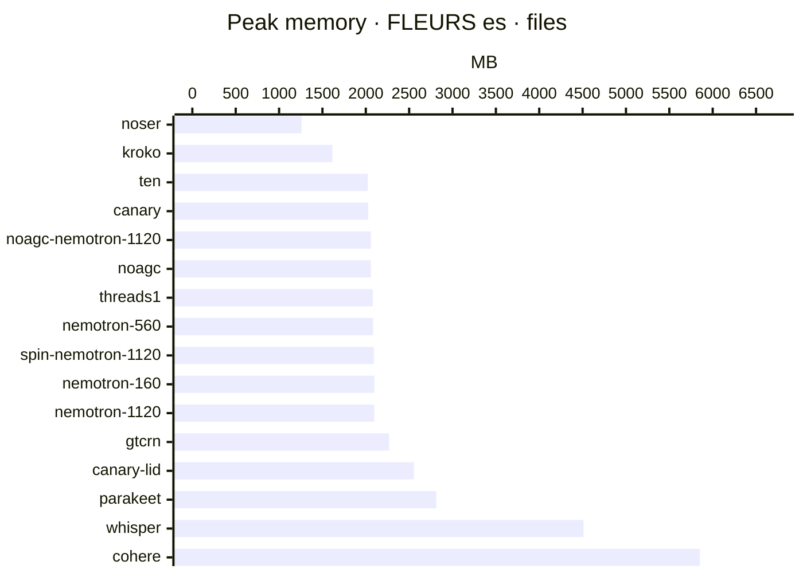
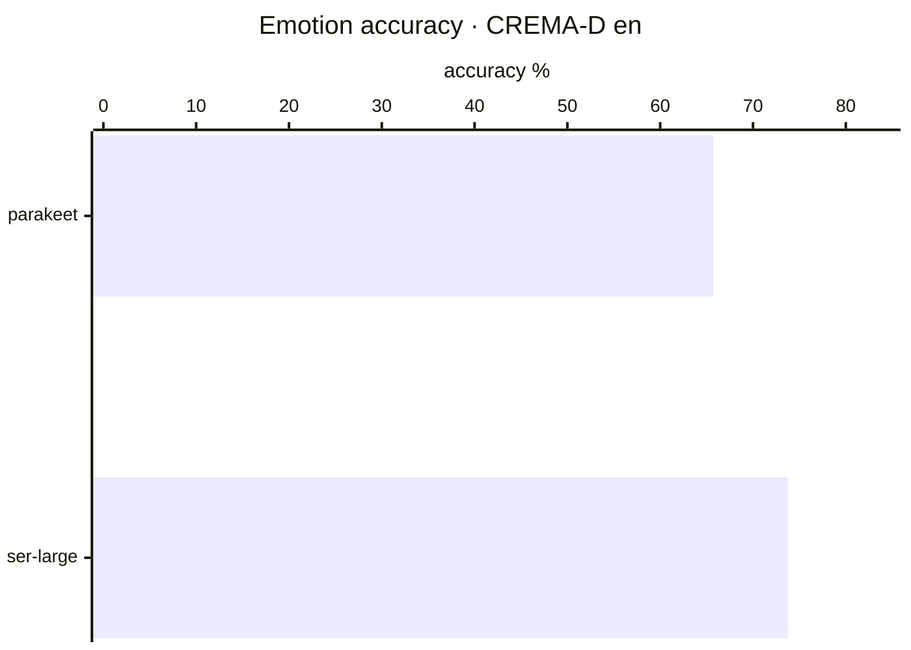
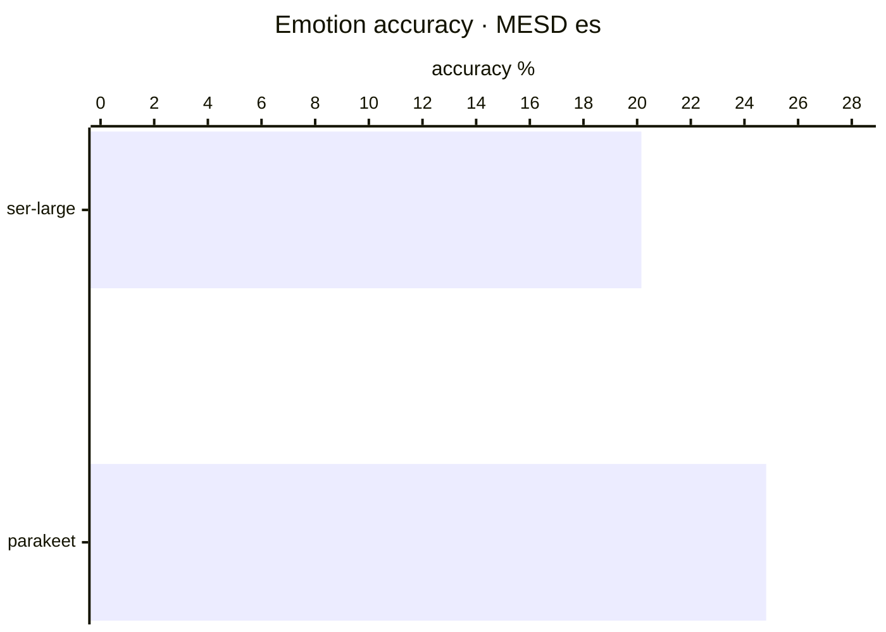

### WER · FLEURS es · files

### WER · FLEURS en · files

### CPU seconds per audio second · FLEURS es · files

### Throughput · FLEURS es · files

### Final after end of speech · p50 · live, 1 stream

### Final after end of speech · p95 · live, 4 streams

### Peak memory · FLEURS es · files

### Emotion accuracy · CREMA-D en

### Emotion accuracy · MESD es

