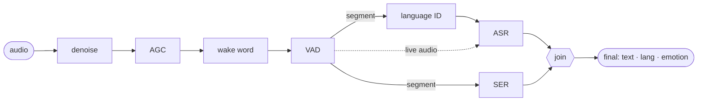

# e-voice

CPU-first speech services in Rust: speech to text (`e-voice`, :5500) and text to speech
(`e-voice-tts`, :5600), two services on one shared core.

## Speech to text

One pipeline — denoise → wake word → VAD → language ID → ASR ∥ SER →
join — behind native, OpenAI, Deepgram and ElevenLabs compatible APIs. Spanish and English, an emotion
on every segment, no GPU.



Every node is a port with swappable backends chosen in [configuration](guide/configuration.md); the
defaults are what the [benchmark](benchmark.md) measured best on CPU.

| Node | Default | Alternatives |
|---|---|---|
| denoise | off | GTCRN |
| ww | off | sherpa KWS (`hey eager`), openWakeWord |
| vad | Silero | TEN |
| lid | off | Whisper tiny |
| asr (live) | Nemotron 3.5 streaming | Kroko, Parakeet, Canary, Cohere, Whisper |
| asr (files) | Parakeet TDT v3 | Canary, Cohere, Whisper, the live backend |
| ser | emotion2vec+ base | emotion2vec+ large, off |

## Quickstart

```bash
make install             # OS packages, pinned Rust, uv, prek, llvm-cov, git hooks
make setup               # sherpa-onnx libraries + the models the config declares
make serve               # gateway on :5500 — reference at http://127.0.0.1:5500/docs
make stt ARGS="--flat"   # another terminal: talk; Ctrl+C to finish
```

Or in a container: `make up` (see [Docker](guide/docker.md)). Clients point at `127.0.0.1:5500` either
way.

```python
from openai import OpenAI

client = OpenAI(base_url="http://127.0.0.1:5500/v1", api_key="unused")
print(client.audio.transcriptions.create(model="whisper-1", file=open("a.mp3", "rb"), language="es").text)
```

## Text to speech

Text in — whole, or token by token from an LLM — and audio out while it is generated, in a voice
learned from a few seconds of audio. The backend is Kyutai Pocket TTS on our own streaming loop; the
port admits only backends that stream frame by frame ([backends](backends.md#tts)).

```bash
make pocket                                          # export + install the Pocket bundles (gated checkpoint)
make voice ID=damien FILES=me.mp3   # learn a voice
EVOICE_TTS__VOICE=damien make speak                  # gateway on :5600
make tts ARGS='"Hola, soy Demian."'                  # hear it
```

```python
client = OpenAI(base_url="http://127.0.0.1:5600/v1", api_key="unused")
client.audio.speech.create(model="pocket", voice="damien", input="Hola.").write_to_file("hola.wav")
```

See [Text to speech](api/tts.md) and [Voices](guide/voices.md).
